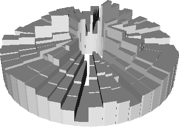

# audio-sculptures

This repository contains Python scripts for generating 3D models that represent audio information. These models can then be fabricated into objects.

Many people before me have worked on code that generates 3D models from audio. Below are some projects I've found, in no particular order:

- [Reify](http://www.reify.nyc/)
- Andy Huntington's [Cylinder](http://extraversion.co.uk/2003/cylinder/)
- [The Vibe](http://3dprinting.com/products/the-vibe-by-soundcloud-shapeways/) by SoundCloud & ShapeWays (see also [this page](http://mary-huang.com/projects/shapeways-vibe/), [this one](http://www.shapeways.com/blog/archives/1249-sound-you-can-touch-3d-print-a-custom-iphone-case-with-your-favorite-sound-from-soundcloud.html))
- [This "model](http://www.3d-printings.org/category/3d-printing-music/) of a laser disc"
- Realit&auml;t's [Microsonic Landscapes](http://www.realitat.com/microsonic/)
- Gene Kogan's [Spectrogram Sculptures](http://www.genekogan.com/works/audio-sculpture.html)

While each of the above projects is awesome in its own way, I wanted to have:

- A completely open source script...
- ...in Python...
- ...that takes an audio file and generate a more or less 3D printer-ready STL file in only one step...
- ...while preserving an accurate representation of the sonic information, so the object can be "played back" to produce (a hopelessly downsampled and bit-reduced version of) the same audio.

I decided to produce this script iteratively. You can find an account of my attempts below.

## Attempt 1: spectrobars
### Rectangular Bar Graph using [tangible](https://github.com/dbrgn/tangible)

The `spectrobars` script reads a WAV file, computes a spectrogram, and generates a model of the bar graph that represents the spectrogram.

The output file is a SCAD file that can be compiled into an STL using [OpenSCAD](http://www.openscad.org/).

#### To Do

- Read MP3 etc. along with WAV
- Generate STL in one step, rather than SCAD
- Make concentric rings like [Microsonic Landscapes](http://www.realitat.com/microsonic/)

## Attempt 2: spectropie
### Concentric Pie Graphs using [tangible](https://github.com/dbrgn/tangible)

`spectropie` reads an audio file, computes its spectrogram, and generates a model of the spectrogram in the shape of concentric ring pie graphs.

The output file is still a SCAD file that can be compiled into an STL using [OpenSCAD](http://www.openscad.org/).

#### To Do

- Read MP3 etc. along with WAV
- Generate STL in one step, rather than SCAD

## Attempt 3: spectrosmooth
### Smooth Concentric Pie Graphs using [numpystl](https://github.com/WoLpH/numpy-stl)

Coming soon...